Step 1: Go to [[Mindgenome.org]{.underline}](http://mindgenome.org)

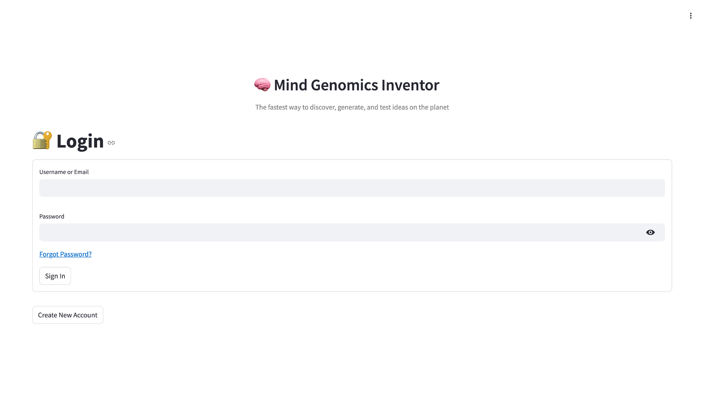{width="6.5in"
height="3.736111111111111in"}

Step 2: Create New Account

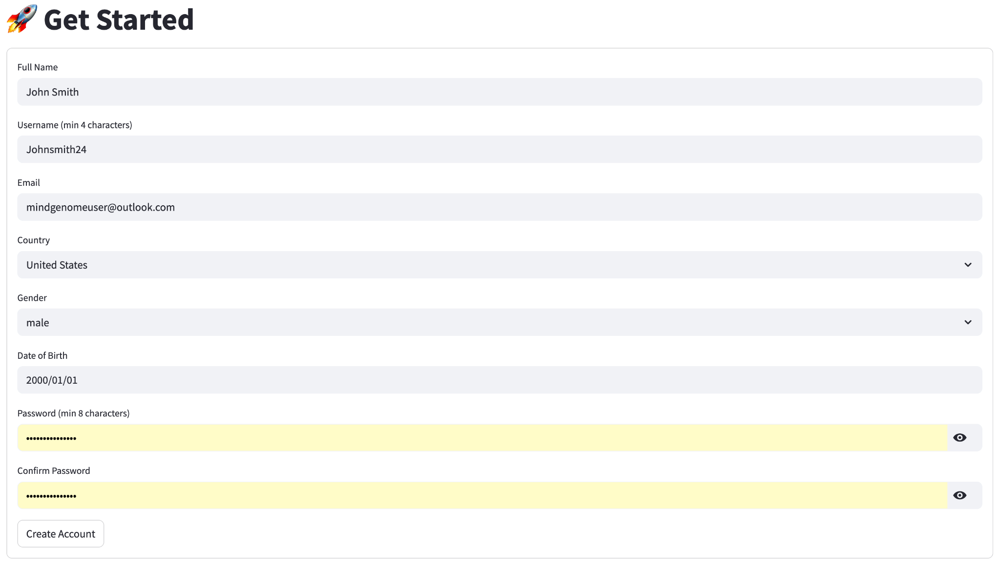{width="6.5in"
height="3.6944444444444446in"}

Enter the following details:

Name (Personal or Business)

Username

Email

Country

Gender

Date of Birth\
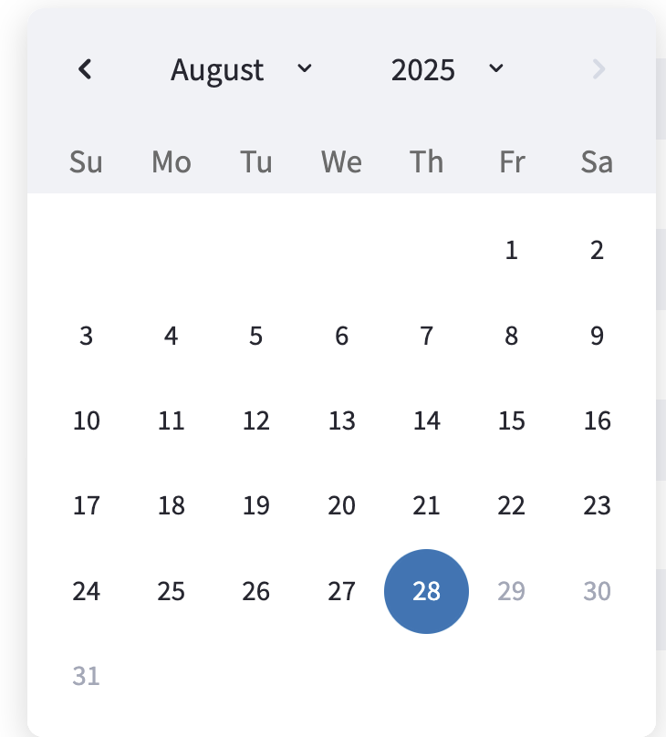{width="2.1120286526684167in"
height="2.3388013998250217in"}\
Password (minimum 8 characters)

Confirm Password

Click the Create Account Button to create your account

Step 3: Verify Email

After creation of the account, you will receive a verification email
from Bimileap required to receive studies.

Note: This verification email may sometimes be delivered to the
spam/junk address

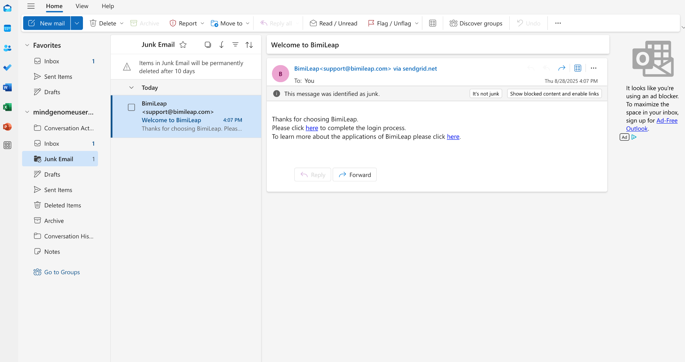{width="6.5in"
height="3.4444444444444446in"}

Please click the link to complete the login process in order to receive
study results.

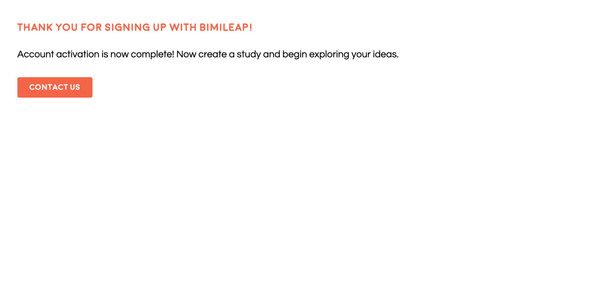{width="6.5in"
height="3.138888888888889in"}

After clicking the link you will see a "Thank you for signing up with
bimileap" page. You are now ready to return to
[[mindgenome.org]{.underline}](http://mindgenome.org), login, and begin
running the inventor

Step 4: Create Project

Log into [[mindgenome.org]{.underline}](http://mindgenome.org) and you
will be ready to create your first project.

**Click** the [Create New Project]{.underline} dropdown.

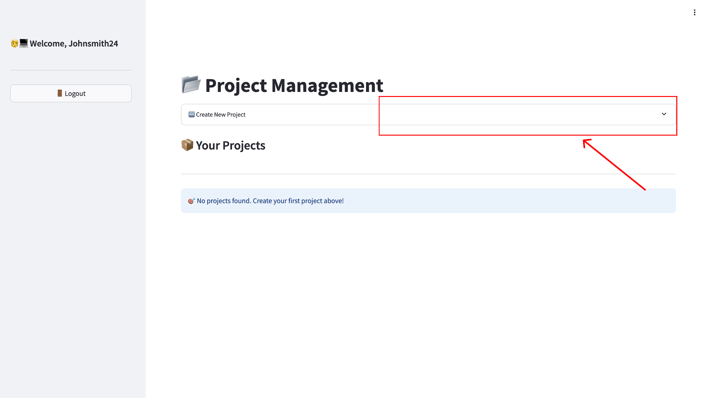{width="6.5in"
height="3.6944444444444446in"}

You will next see an input for Project Name and Description. Input both
then **Click** [Create Project]{.underline}

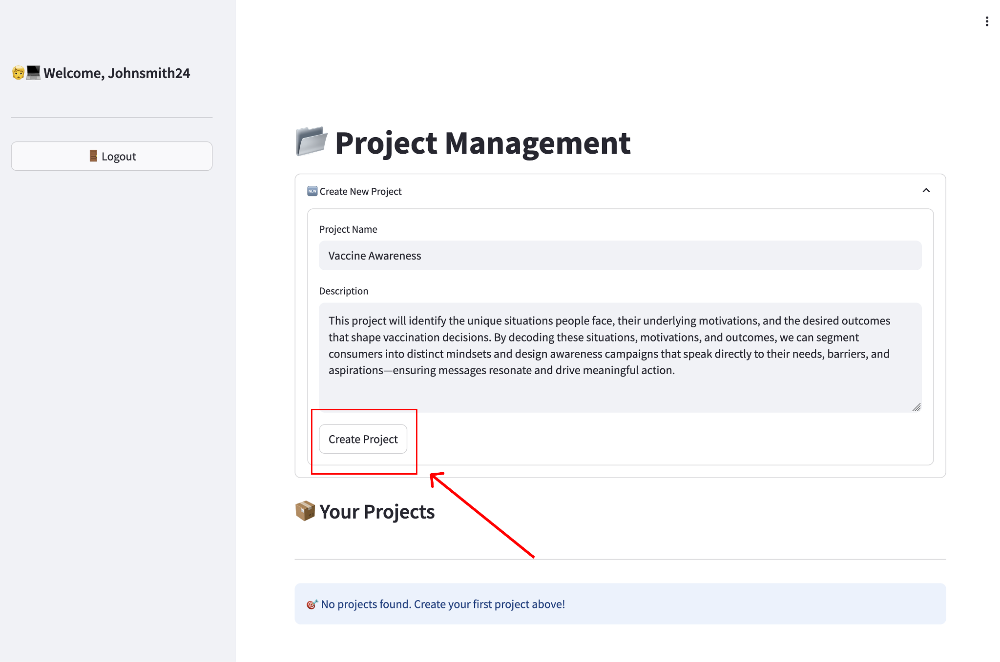{width="6.5in"
height="4.305555555555555in"}

After creating your project, you can now open the project. **Click**
[Open Project]{.underline}

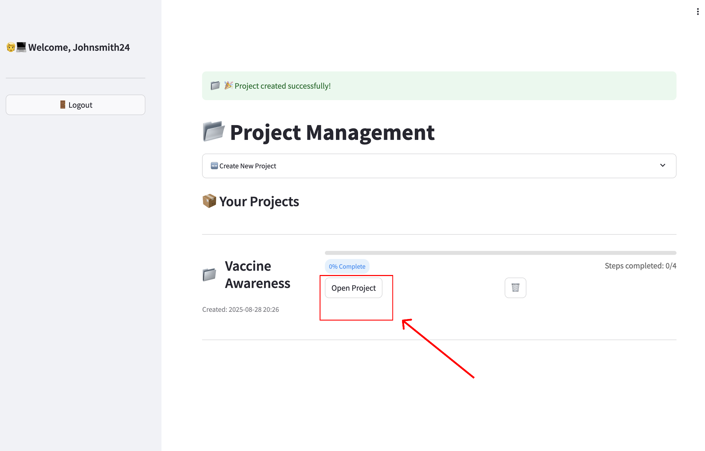{width="6.5in"
height="4.166666666666667in"}

Step 5: Upload Your Documents (Optional)

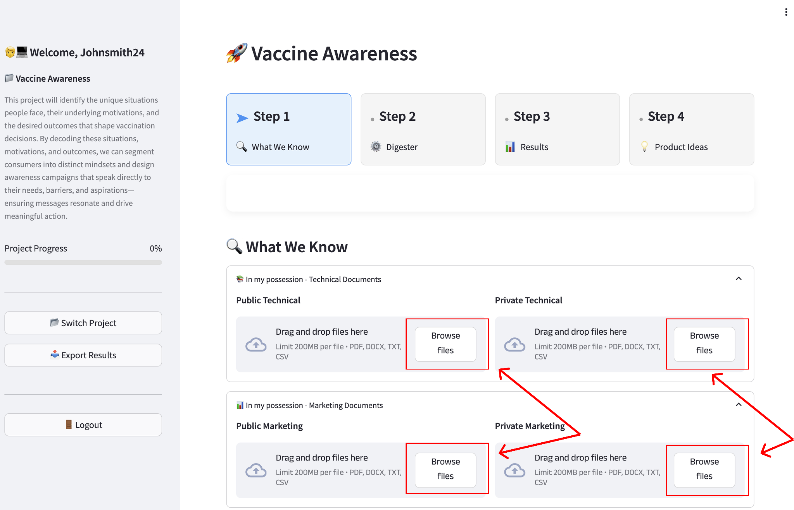{width="6.5in"
height="4.180555555555555in"}

You can upload two types of papers:

- **Technical Papers** -- Scientific or product-related information such
  as ingredients, functional benefits, technologies, or research
  findings.

- **Marketing Papers** -- Consumer-facing information such as marketing
  claims, consumer statements, positioning, or promotional materials.

Each paper should be classified as:

- **Public** -- From the public domain.

- **Private** -- Your internal documentation.

After uploading your documents will be visible, and you may move on to
the next step

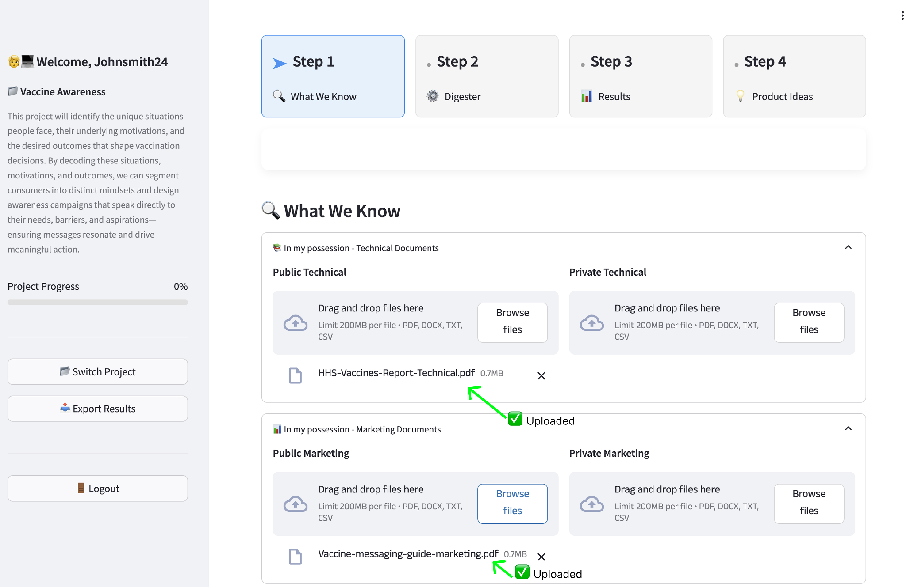{width="6.5in"
height="4.222222222222222in"}

Step 6: Scrape Papers

**Scroll Down** and you will see [Scrape Papers]{.underline}. If you
would like to scrape **Technical Documents** from the web, you may input
a query and a year range. The process will then scrape Google Scholar
for a range of available papers related to your query.

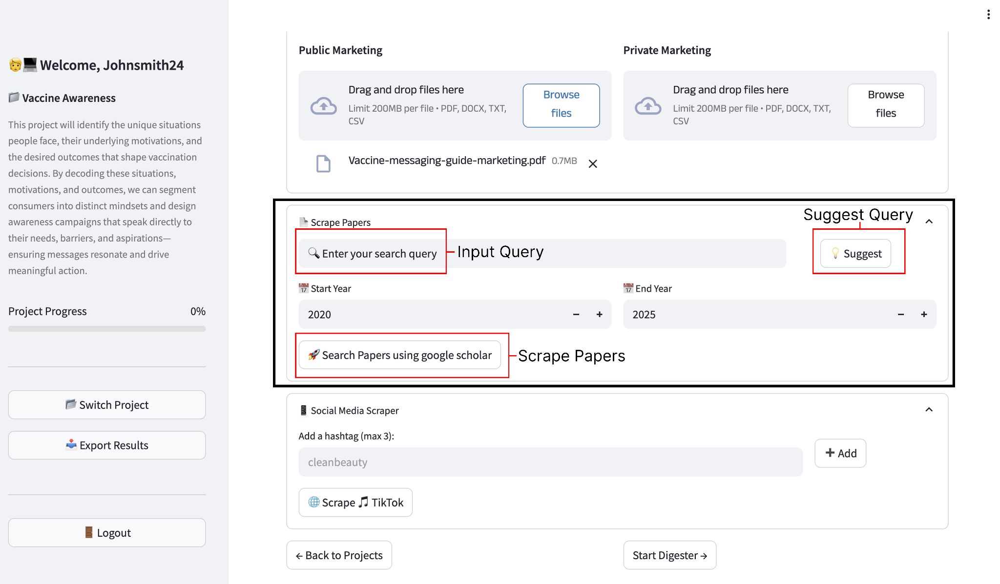{width="6.5in"
height="3.8055555555555554in"}

After inputting your query, click search papers. The process will take
1-2 minutes to extract papers

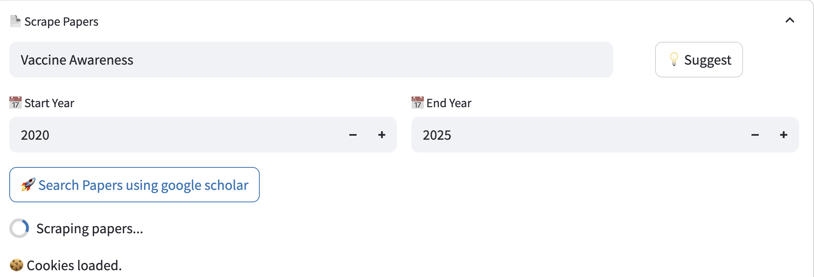{width="6.5in"
height="2.2222222222222223in"}

After 30 seconds - 1 minute, a list of papers will be extracted. You may
select **up to 5** to be used for **technical papers**

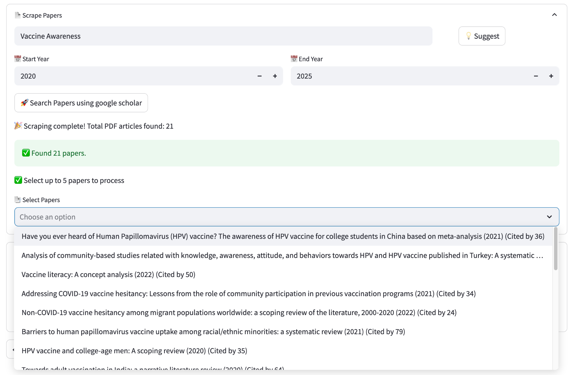{width="6.5in"
height="4.152777777777778in"}

Once you have selected **5 papers,** Click **Process Selected Papers**
to prepare the selected technical papers for extraction

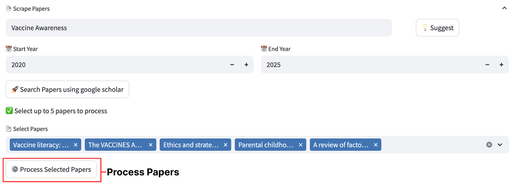{width="6.5in"
height="2.3333333333333335in"}

Step 7: Scrape Social Media

**Scroll Down** and you will see [Scrape Social Media]{.underline}. If
you would like to scrape **Consumer Statements** from tiktok, you may
input **up to 3 hashtags**. The process will then scrape Tiktok for **20
videos per hashtag**, **a transcription of the video**, and **100
comments per video.**

When inputting hashtags, we recommend using the following resources

A)  Tiktok Creative center\
    [[https://ads.tiktok.com/business/creativecenter/inspiration/popular/hashtag/pc/en]{.underline}](https://ads.tiktok.com/business/creativecenter/inspiration/popular/hashtag/pc/en)

B)  AI Resources (Chatgpt, Gemini, etc). Input your project description
    and ask AI to come up with 3 popular hashtags.

\*\*note - when adding the hashtags, **DO NOT** put the \# symbol. The
system will automatically handle it

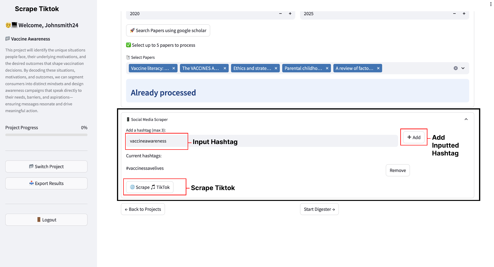{width="6.5in"
height="3.513888888888889in"}

After clicking **Scrape Tiktok**, please wait **3-5** minutes for the
social media scraping to occur. **DO NOT CLOSE OUT OF THE WEBPAGE -**
the application is not set to run in the background currently. This will
be enhanced in a future version

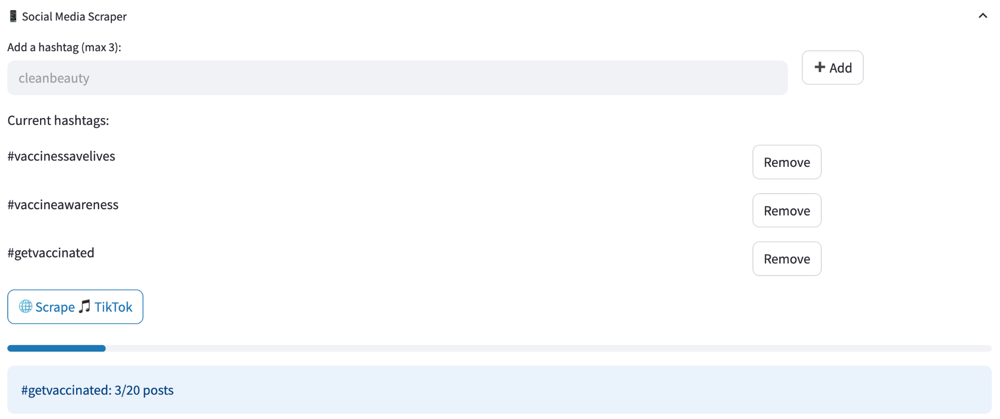{width="6.5in"
height="2.7222222222222223in"}

After the scraping is complete, you will see the raw consumer statements
extracted from social media.

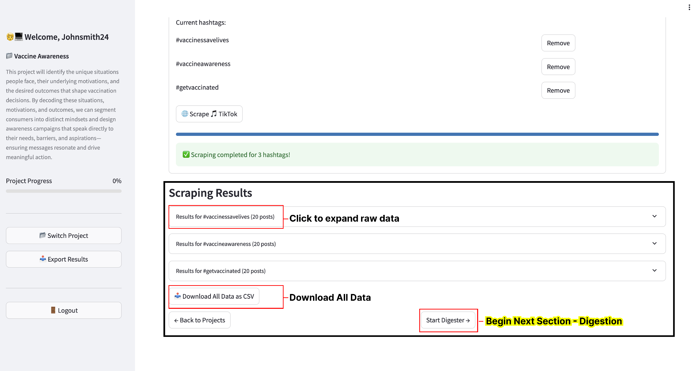{width="6.5in"
height="3.486111111111111in"}

You can click results to view detailed information, download all as a
CSV, or proceed on to the next section **DIGESTION**

Click to expand the raw data and you will see the below data:

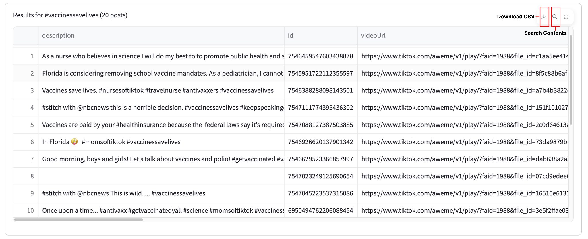{width="6.5in"
height="2.6527777777777777in"}

The data contains the following fields:

- **Description** -- This is the video description the uploader attached
  to the video

- **ID** - The unique record id of the video

- **VideoURL** - The URL to watch the video online

- **createTime** - The date the video was uploaded

- **collectCount** - The number of times the video was saved to user
  collections

- **commentCount** - The number of comments on that video

- **playCount** - The number of views the video has

- **shareCount** - The number of times the video was shared

- **Transcript** - This is a transcription of the audio of the video

- **Comments** - A list of up to 100 comments posted on the video

- **Hashtag** - The inputted hashtag attached to this video

- **User_info.name** - The name of the video uploader

- **User_info.bio** - The bio of the video uploader

- **User_info.username** - The username of the video uploader

- **User_info.followers** - The number of followers the video uploader
  has

- **User_info.following** - The number of users the video uploader is
  following

- **User_info.totalLikes** - The number of total likes the video
  uploader has

You may search within this data for a query **match**, or you can export
the data as CSV.

Next click **Start Digester** to begin the next step of digestion

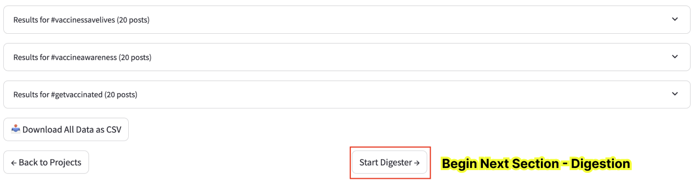{width="6.5in"
height="1.6944444444444444in"}

Step 8: Digesting Marketing and Technical Information

Click **Start Digester**. After the digestion is complete, you will see
the digested data outputs.

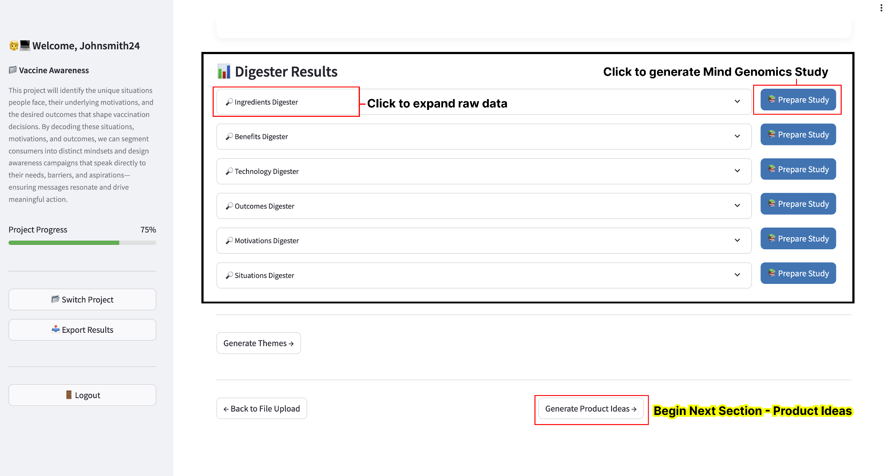{width="6.5in"
height="3.486111111111111in"}

The following digesters are as defined:

- Marketing Digesters (Using Marketing Papers & Social Media scraped
  data as input)

  - **Situations** → *What's going on around the person?* (the context
    or moment they're in).

  - **Motivations** → *Why do they act?* (the reason or drive behind
    their choice).

  - **Outcomes** → *What do they want to happen?* (the result or benefit
    they hope to get).

- Technical Digesters (Using Technical Papers & Google Scholar scraped
  papers as input)

  - **Ingredients** → *What goes in?* (the parts, materials, or
    components used).

  - **Benefits** → *Why does it matter?* (the good things people get
    from it).

  - **Technologies** → *How does it work?* (the methods, tools, or
    processes that make it happen).

Click to expand a digester (using situations as reference for this
example). You will see a list of all unique elements extracted. You then
have the option to select which elements will be used for study
generation input.

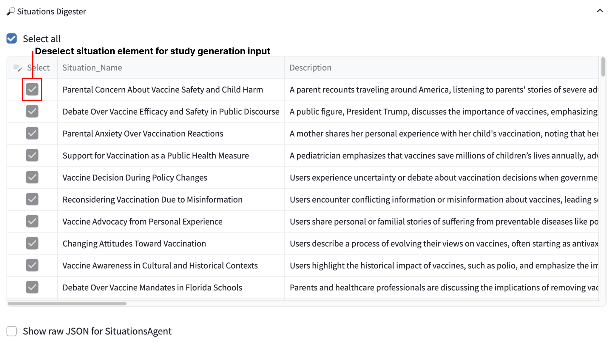{width="6.5in"
height="3.6527777777777777in"}

After you have modified your selected input, you may now **Generate a
Study** for the digester. Click the **Prepare Study** button next to the
situations digester

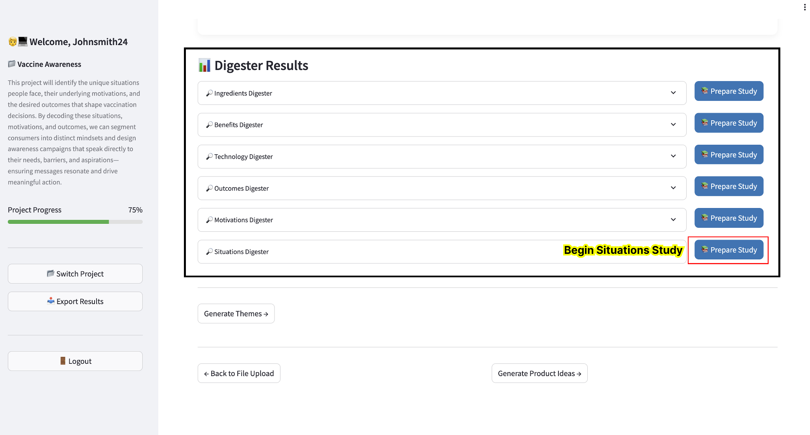{width="6.5in"
height="3.486111111111111in"}

Step 9: Prepare Study

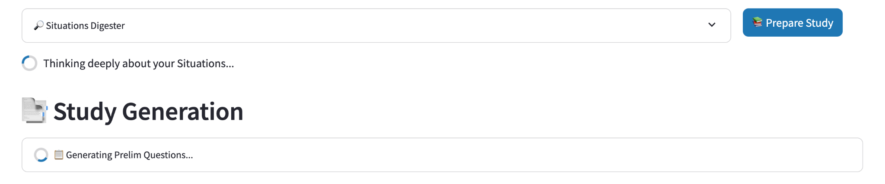{width="6.5in"
height="1.3611111111111112in"}

After you click to prepare study, you will see the study generation is
in process. Please allow 30 seconds to generate the complete study
structure. Once it is complete please scroll down to see the prepared
study

**[Study Review]{.underline}**

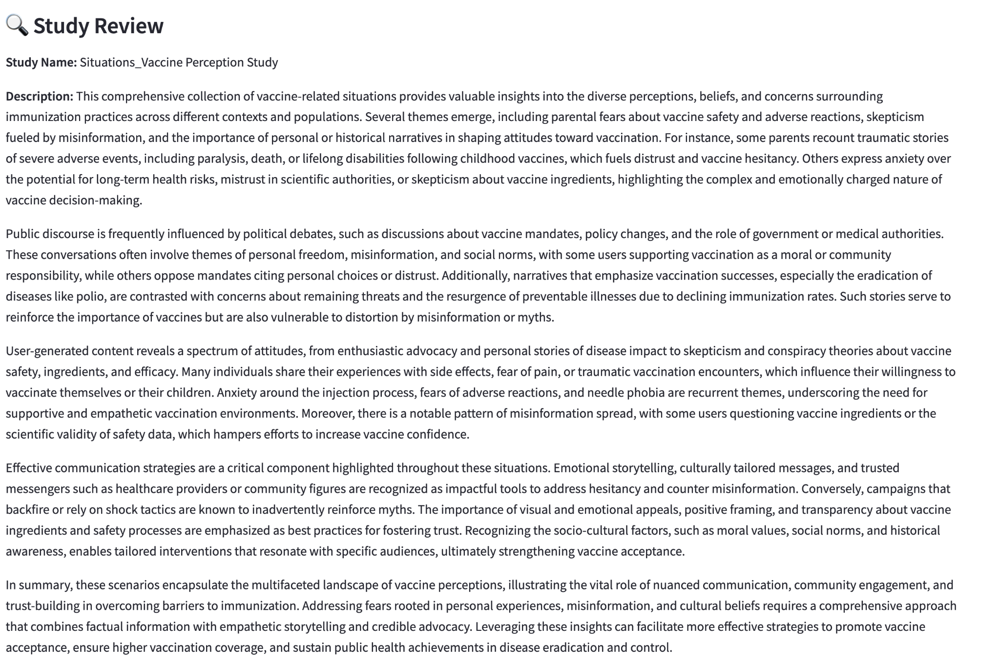{width="6.5in"
height="4.319444444444445in"}

The Study Review will contain the **Study Name, Study Description,
Respondent Orientation**, and **Final Thoughts**

Continue to scroll down and you will see the following Study Questions
generated\
\
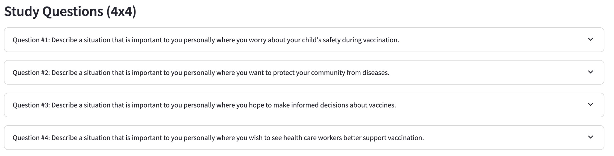{width="6.5in"
height="1.6666666666666667in"}

The study questions are the four unique categories that will be tested
in the study. If you click the dropdown you will see that each of the 4
categories has 4 unique elements

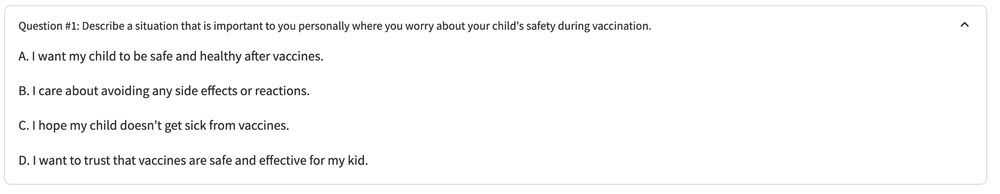{width="6.5in"
height="1.2638888888888888in"}

Each element is unique, generated using our digested process, and
structured in consumer facing language ready for the study.

Scroll down a little and you will see the generated classification
questions (preliminary questions). These are the questions that will be
asked to the respondents at the beginning of the study.

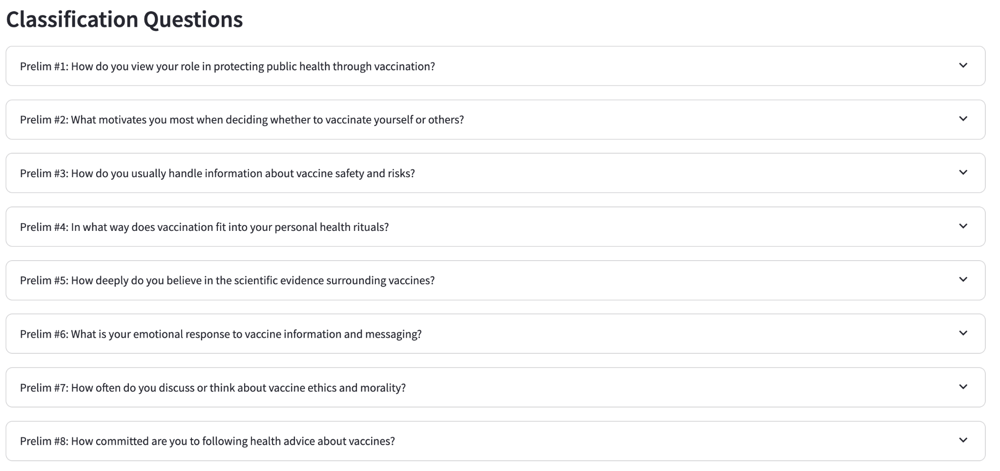{width="6.5in"
height="3.0694444444444446in"}

If you click the dropdown you will see that each of the classification
questions have 3 unique answers - one answer is designed for positive
sentiment, one for neutral, and one for negative.

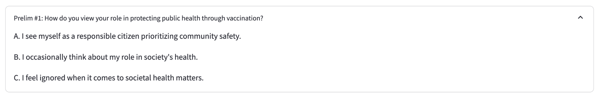{width="6.5in"
height="1.0277777777777777in"}

After glancing over the information, you will have two options. If you
are content with the study structure, you may run a study with 100
synthetic respondents. If you want to modify click **Edit Questions**.
Click edit questions

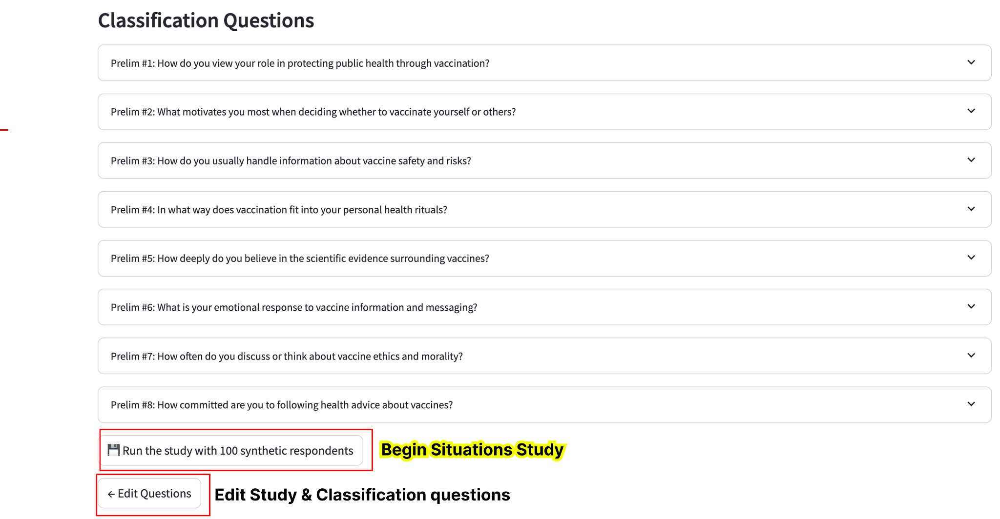{width="6.5in" height="3.375in"}

You will have the opportunity to edit your preliminary questions. Click
a dropdown and you will see you can edit the preliminary questions and
options.

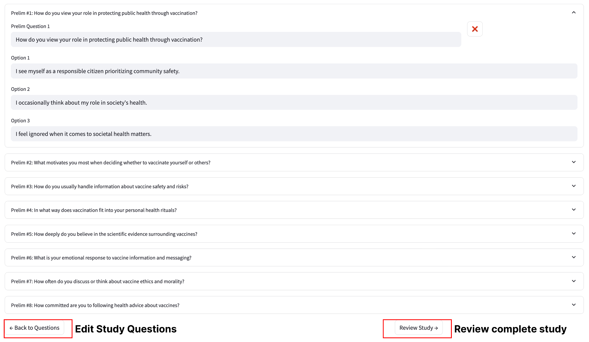{width="6.5in"
height="3.7777777777777777in"}

After you edit a field, it is important you **CLICK ENTER BUTTON** to
save the changes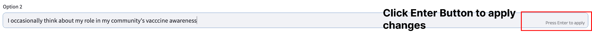{width="6.5in"
height="0.3611111111111111in"}

Once you have completed editing the preliminary questions, click Back to
Questions to edit the study questions

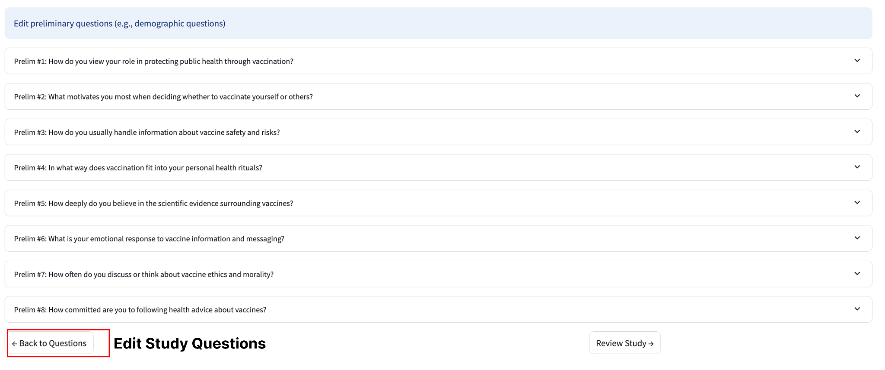{width="6.5in"
height="2.736111111111111in"}

You will have the opportunity to edit the study questions. After you
edit the study questions, click Next: Prelim Questions, and then click
review Study

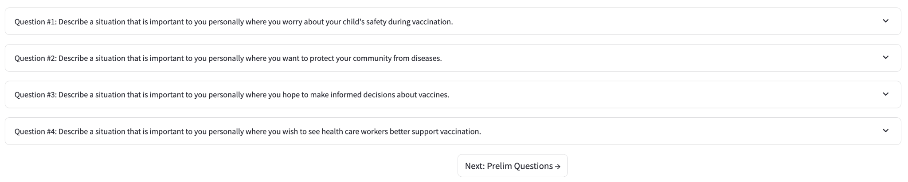{width="6.5in"
height="1.3055555555555556in"}

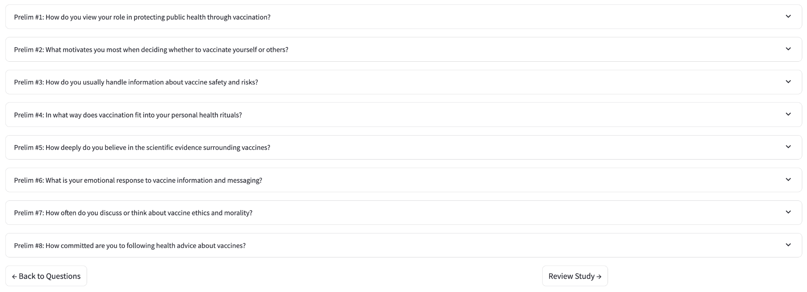{width="6.5in"
height="2.361111111111111in"}

Now you are ready to process your study. Scroll down and click the Run
the study with 100 synthetic respondents.

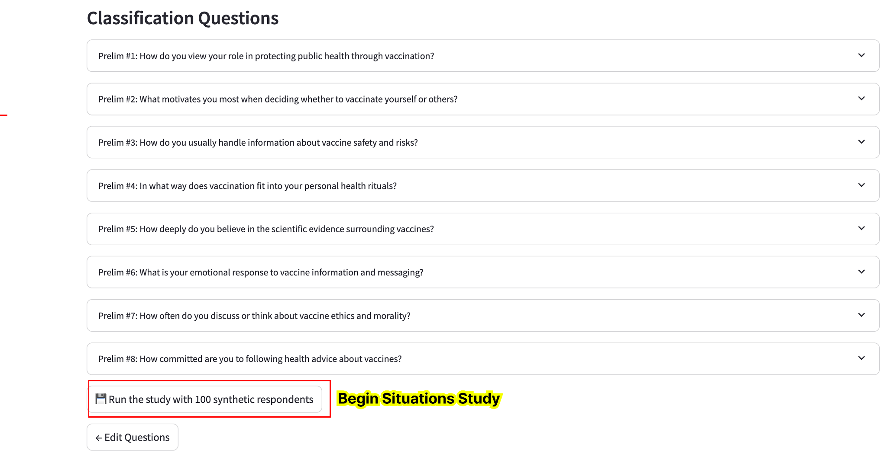{width="6.5in" height="3.375in"}

After you click the run study button, you will see that the study
process begins. Please allow 2-3 minutes for this to complete. DO NOT
close the browser

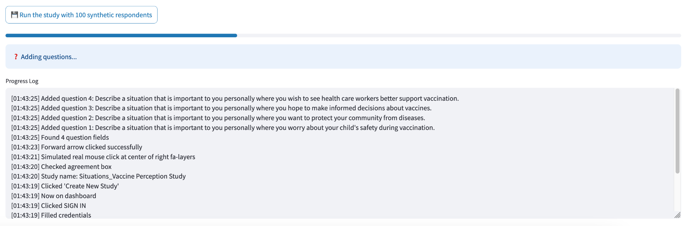{width="6.5in"
height="2.138888888888889in"}

After completion, you will see a success message - the study creation
has been successful! You will receive a study preview in the new few
minutes, and the study results in 1-2 hours.

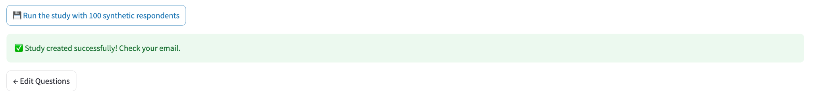{width="6.5in"
height="0.7638888888888888in"}

Step 10: View Study

Please go to your email (check inbox and junk), and you will see that
the study has been created.

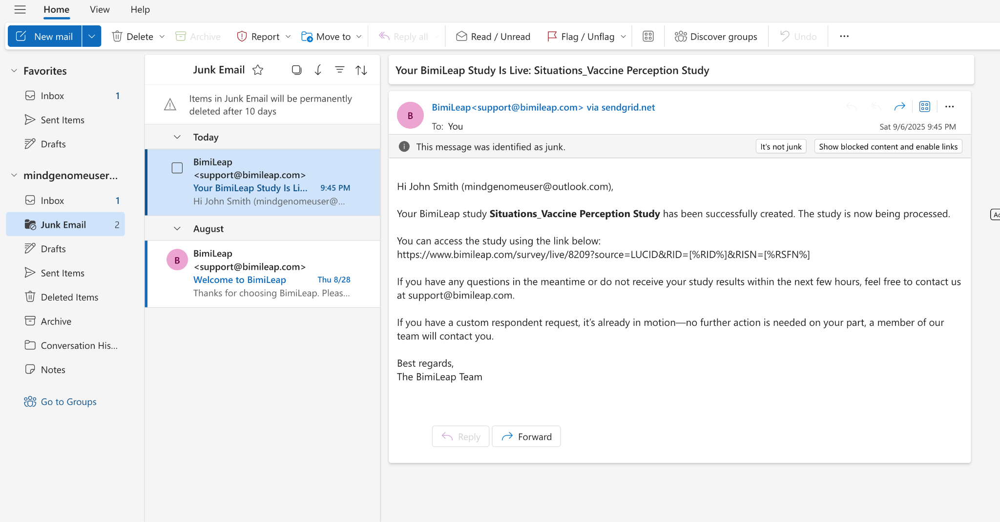{width="6.5in"
height="3.4027777777777777in"}

Copy the study link into the browser and you will be able to preview the
study

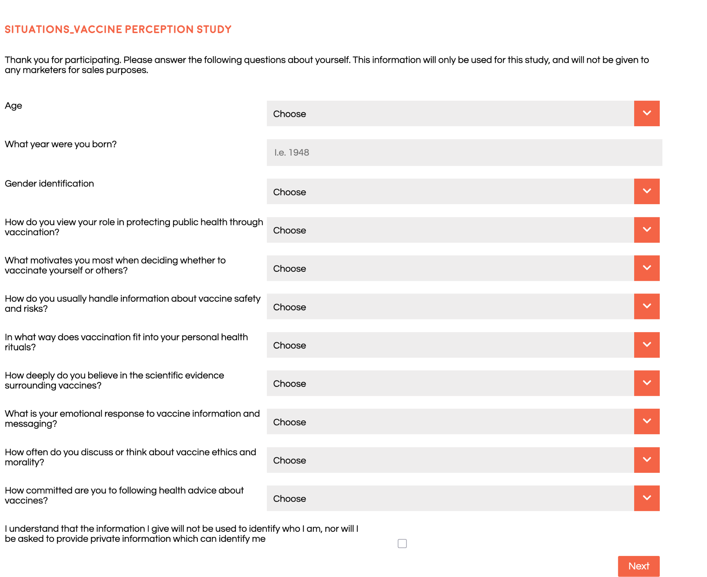{width="6.5in"
height="5.305555555555555in"}

You may preview the entire study, and the results will be arriving in
1-2 hours.
